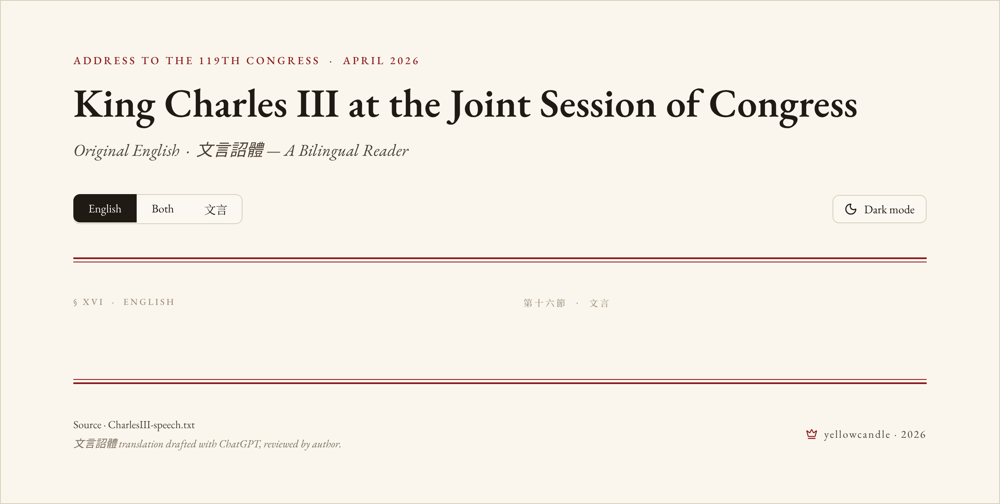

# King Charles III · Joint Session of Congress — Bilingual Reader

A static reader for King Charles III's address to the Joint Session of the U.S.
Congress (April 2026, semi-quincentennial of the Declaration of Independence).
Each English paragraph appears side-by-side with a 文言詔體 (Classical Chinese
imperial-edict) rendering written in the voice of an ancient Chinese sovereign
(朕…詔曰…).

Linked entities — persons, events, documents, places — open the matching
Wikipedia article: **English column → en.wikipedia.org**, **文言 column →
zh.wikipedia.org**. Each linked phrase carries a superscript marker; expanding
the per-section `notes ▸` drawer reveals a short Wikipedia gloss for every
entity in that paragraph.

## Sources

- English original: [CTV News full transcript](https://www.ctvnews.ca/canada/royal-family/article/full-speech-king-charles-addresses-us-congress-highlights-uk-us-bond/) — local copy in `CharlesIII-speech.txt`.
- 文言詔體 translation drafted with ChatGPT, reviewed by author. Wikipedia anchors curated by hand.

## Project layout

```
.
├── index.html            # built output — the deployable artifact
├── styles.css            # parchment palette, EB Garamond + Noto Serif TC, two-column responsive grid
├── script.js             # ~70 lines: theme + view-mode toggles with localStorage
├── CharlesIII-speech.txt # source of truth for the parallel text
├── webui.pen             # Pencil design source (regal, parchment-paper direction)
├── tools/
│   ├── build_html.py     # one-shot generator that turns the .txt + entity catalog into index.html
│   └── wiki_cache.json   # cached Wikipedia summaries — committed for reproducible offline rebuilds
└── README.md
```

## Local preview

The site is plain static files — any HTTP server works:

```bash
python3 -m http.server --bind 127.0.0.1 8765
# open http://127.0.0.1:8765/
```

Or with Node:

```bash
npx serve .
```

Loading `file://.../index.html` directly works in most browsers but Google
Fonts may be blocked by file-protocol CORS — prefer a real HTTP server.

## Regenerating after editing the text

If you edit `CharlesIII-speech.txt` or the entity catalog inside
`tools/build_html.py`, regenerate `index.html`:

```bash
python3 tools/build_html.py
```

The generator parses the `**Original** > … **文言詔體譯** > …` blocks, applies
the curated phrase-to-Wikipedia-slug catalog (longest match first, once per
paragraph), fills the per-section footnote drawers from `tools/wiki_cache.json`,
and writes the full HTML.

### Footnote glosses & the Wikipedia cache

`tools/wiki_cache.json` holds a short Wikipedia summary for every curated slug,
keyed by `"{host}/{article-slug}"`. It's committed to the repo so subsequent
builds run offline and produce byte-identical output.

- **First build (or after `rm tools/wiki_cache.json`)** fetches every entry
  from the matching `en.wikipedia.org` / `zh.wikipedia.org` host. Requires
  network. Roughly 100 entries, ~30 s.
- **Subsequent builds** use only the cache — no network calls.
- **A specific entry's gloss is wrong or unhelpful?** Edit its `extract` (and
  optionally `title`, `description`) in `tools/wiki_cache.json` and add
  `"_manual": true` to the entry. The build skips re-fetching `_manual` entries
  even after `rm`-and-rebuild won't reach them. Example:

  ```json
  "zh.wikipedia.org/英联邦": {
    "title": "英聯邦",
    "extract": "由前英帝國諸國組成之國際組織……",
    "description": "英语国家国际组织",
    "_manual": true
  }
  ```

- **Refresh the whole cache**: `rm tools/wiki_cache.json && python3 tools/build_html.py`.
  All non-`_manual` entries re-fetch from current Wikipedia.
- **Strict mode**: `python3 tools/build_html.py --strict` exits non-zero if
  any entry fails to fetch — useful in CI.

## Verifying Wikipedia links

```bash
grep -oE 'href="https://(en|zh)\.wikipedia\.org/wiki/[^"]+"' index.html \
  | sed -E 's/^href="//; s/"$//' | sort -u \
  | while read -r u; do printf '%s  %s\n' "$(curl -s -o /dev/null -w '%{http_code}' -L --max-time 8 "$u")" "$u"; done
```

Expected: every URL returns `200`. The generator does not auto-fix slugs —
broken links are surfaced here for manual correction in the catalog.

## Deployment

The build artifact is just three files: `index.html`, `styles.css`,
`script.js`. The `CharlesIII-speech.txt` source is also linked from the
footer, so include it in the deploy.

### Cloudflare Pages (recommended)

1. Push the repo to GitHub.
2. Cloudflare dashboard → **Workers & Pages → Pages → Connect to Git** → select the repo.
3. Build settings — **Build command: (leave blank)**, **Build output directory: `/`**, **Branch: `main`**.
4. First deploy in ~30 s. Auto-deploys on every push.

### GitHub Pages

1. Push to GitHub.
2. Repo **Settings → Pages → Source: Deploy from a branch**, **Branch: `main` / `(root)`**.
3. URL: `https://<user>.github.io/king-charles-iii-speech/`.

Both serve the same artifact; the choice is operational.

## Design



Direction: regal, parchment paper. Palette is `#faf6ee` ground, `#1f1a14` ink,
`#8b1a1a` cinnabar accents, `#d9d1bd` rules. EB Garamond for English, Noto
Serif TC for 文言. Two-column at desktop, stacks at &lt; 820 px. Dark-mode
toggle persists in `localStorage`. View-mode segmented control switches
between English-only, Both, or 文言-only. Print stylesheet linearises the
layout and hides the toolbar.

The Pencil source lives in `webui.pen` — open with [Pencil](https://pencil.io)
to edit. Re-export the PNG with the Pencil MCP `export_nodes` tool or via the
Pencil GUI.

> **Note:** the `.pen` file persists to disk only when Pencil's GUI processes
> a save event. If you only ever drove Pencil through the MCP, save once from
> the Pencil app to commit the design data to disk.
